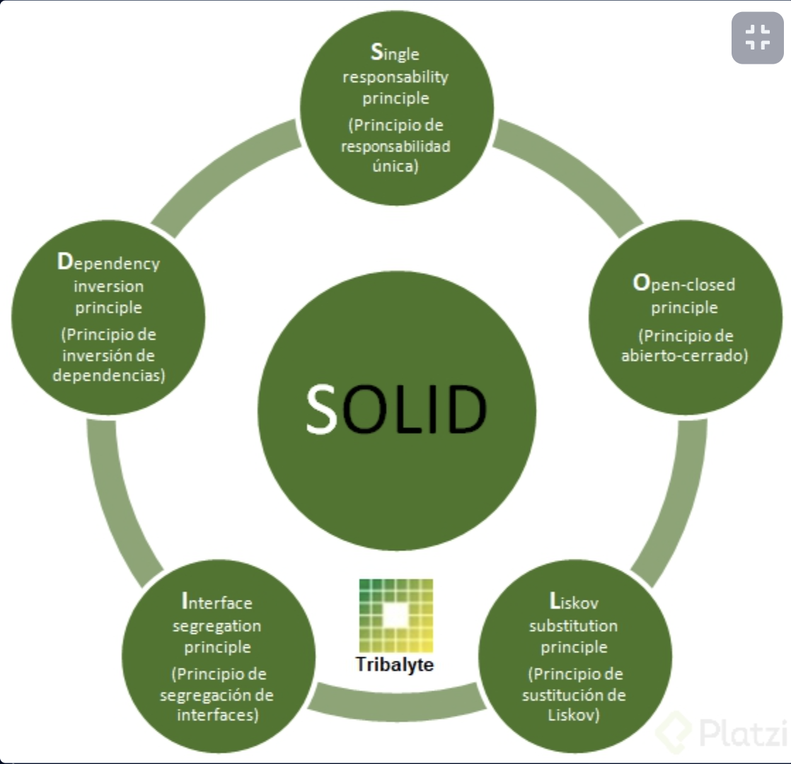
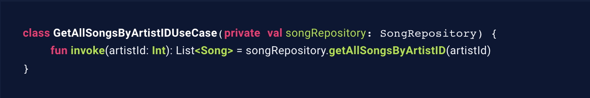
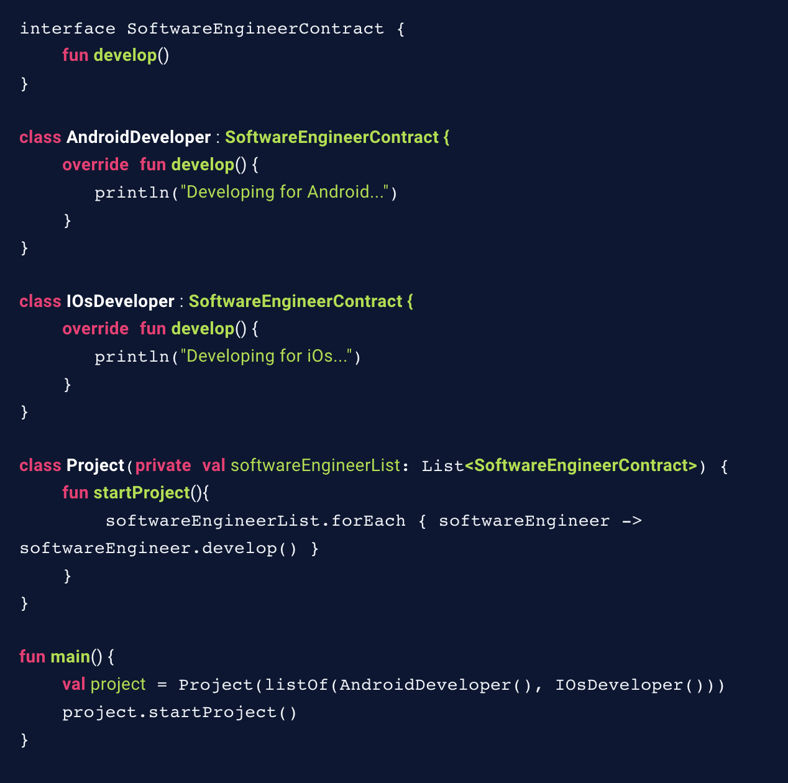
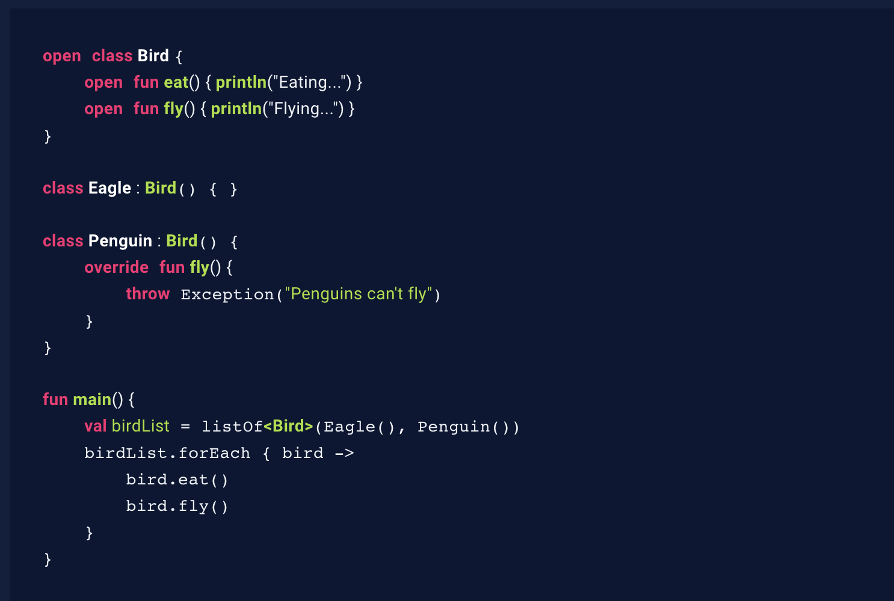
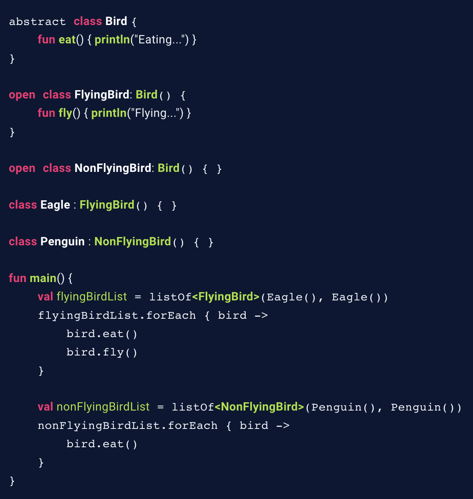
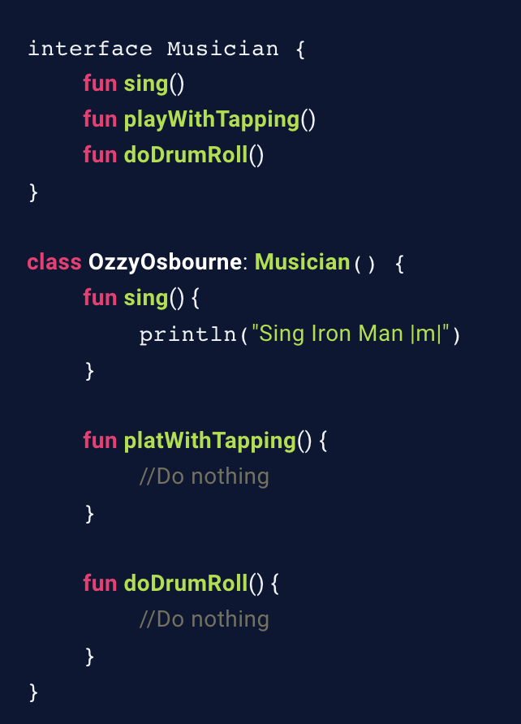
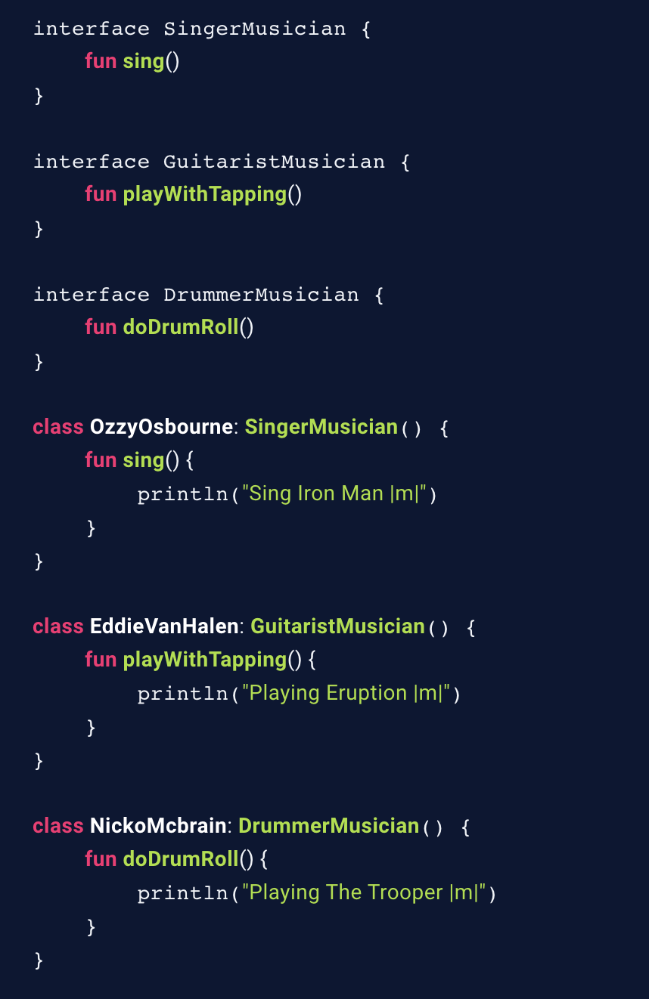
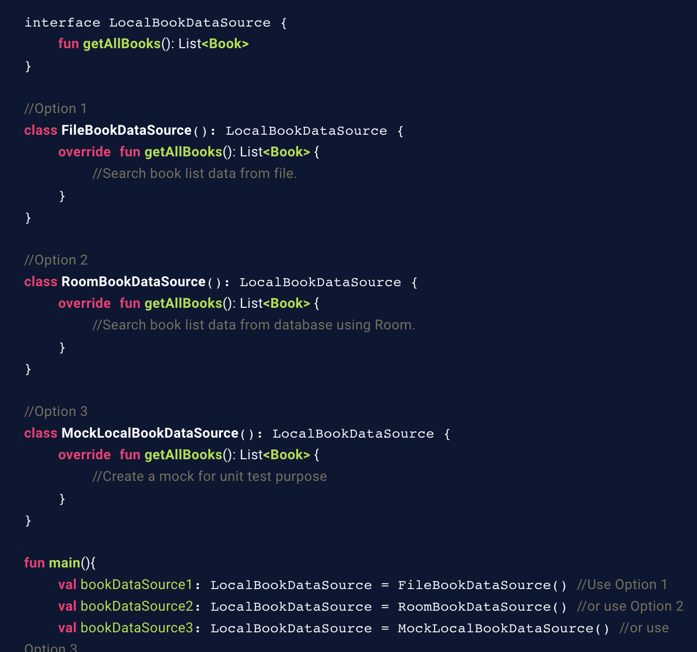
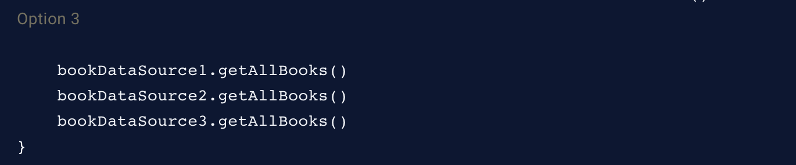

## SOLID principles

## Single Responsibility Principle
Este principio dice que, básicamente, una clase, módulo o componente debe tener sólo una raz ón para cambiar. En este ejemplo, el objetivo de esta clase es obtener el caso de uso de una aplicación que necesita obtener todas las canciones de un artista a partir de su ID, dándole sólo un propósito que manejar, y esto lo hace solamente invocando al repositorio correspondiente para obtener la información.

## Principio de Abierto/Cerrado (Open/Closed Principle)
Este principio indica que una entidad de software debe quedar abierta para su extensión, pero cerrada para su modificación. Para este ejemplo, imagina que hay diferentes roles para un ingeniero de software y al inicializar un proyecto, cada uno de ellos empieza a trabajar en su plataforma. Usando este principio, podemos definir una entidad tal como SoftwareEngineerContract, que será con la que trabajaremos en Project, y si se llegaran a crear más puestos como, por ejemplo, un PythonDeveloper, esta clase, en teoría, no se ve afectada. 

## Principio de Sustitución de Liskov (Liskov Substitution Principle)
Este principio establece que cada clase que hereda de otra puede usarse como su padre sin necesidad de conocer las diferencias entre ellas. En este ejemplo la clase Bird define dos métodos, y su clase hija Eagle trabaja con estas sin problema aparente, pero tenemos otra clase hija, Penguin, que sobreescribe la función fly() para lanzar una excepción, por lo que te imaginarás, cuando se ejecute la función main() el programa fallará.

**Implementación incorrecta**

**Implementación CORRECTA**

## Principio de Segregación de Interfaces (Interface Segregation Principle)
Este principio plantea que los clientes de un programa dado sólo deberían conocer los métodos que realmente usan. ¿Cuántas veces te ha tocado que una clase implementa interfaces que deja vacías las implementaciones de algunos métodos, o peor aún, que lanzan excepciones que realmente no son necesarias en el flujo de tu proyecto?
Imagina el siguiente ejemplo: se define una interfaz Musician, la cual tiene los métodos sing() (lo que hace un cantante), playWithTapping (tocar con una técnica muy popular entre algunos guitarristas y bajistas) y doDrumRoll() (hacer redobles en el tambor o tarola). La clase OzzyOrbourne implementa la interfaz y sabe usar sing() (“Iron Man 🎤”), pero los demás métodos no los usa, por lo que quedan vacíos.

**Implementación incorrecta**
 

**Implementación CORRECTA**
 

## Principio de Inversión de Dependencias (Dependency Inversion Principle)
Indica que los módulos de alto y bajo nivel deben depender de abstracciones, es decir, los detalles deben depender de abstracciones. Para el siguiente ejemplo se indica una interfaz LocalBookDataSource que será el contrato que definan las clases FileBookDataSource (que obtiene los libros a partir de un archivo), RoomBookDataSource (que obtiene los libros a partir de una base de datos manejada con Room) y MockLocalBookDataSource (que se puede utilizar para realizar pruebas unitarias). De esta forma, puedes utilizar alguna de estas implementaciones en la función main() sin afectar el código de tu aplicación. Más adelante te enseñaré con detalle este principio en acción con el proyecto final.
 
 

